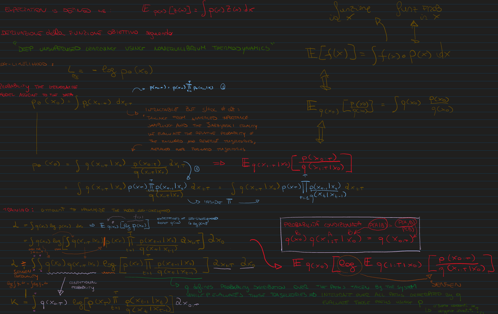

# Deriving the Objective Function from  

**"Deep Unsupervised Learning using Nonequilibrium Thermodynamics"**

This derivation aims to express the log-likelihood of a generative model via nonequilibrium thermodynamic principles and estimate it using importance sampling over stochastic trajectories.

---

## **Objective: Log-Likelihood of the Data**

Given a data distribution $q(x_0)$ (typically an empirical distribution from the dataset), the goal is to maximize the expected log-likelihood under a generative model $p_\theta(x_0)$:

$$
\mathcal{L_\theta} = \mathbb{E}_{q(x_0)} \left[ \log p_\theta(x_0) \right]
$$

---

## **Intractability of the Marginal Likelihood**

The model defines a joint distribution over a trajectory $x_{0:T} = (x_0, x_1, \dots, x_T)$. The marginal likelihood of $x_0$ is:

$$\
p_\theta(x_0) = \int p_\theta(x_{0:T}) \, dx_{1:T}
$$

where the joint is decomposed as a **reverse process**:

$$
p_\theta(x_{0:T}) = p(x_T) \prod_{t=1}^{T} p_\theta(x_{t-1} \mid x_t)
$$

Here:
- $p(x_T)$ is a simple prior (e.g., standard Gaussian),
- $p_\theta(x_{t-1} \mid x_t)$ is the learned generative model (parameterized by a neural network).

---

## **Importance Sampling via a Forward Process**

The marginal likelihood $p_\theta(x_0)$ is intractable due to the high-dimensional integral over all possible trajectories $x_{1:T}$. To estimate it, we apply **importance sampling**, a technique that lets us rewrite an expectation over a difficult distribution $p$ using samples from a simpler, tractable distribution $q$.

We define a tractable **forward (proposal) process** $q(x_{1:T} \mid x_0)$, and use it to rewrite:

$$
p_\theta(x_0) = \int q(x_{1:T} \mid x_0) \cdot \frac{p_\theta(x_{0:T}) }{q(x_{1:T} \mid x_0)} \, dx_{1:T}
$$

Taking the expectation over $q$:

$$
p_\theta(x_0) 
= \mathbb{E}_{q(x_{1:T} \mid x_0)} \left[ \frac{p_\theta(x_{0:T}) }{q(x_{1:T} \mid x_0)} \right] 
= \mathbb{E}_{q(x_{1:T} \mid x_0)} \left[ \frac{p(x_T) \prod_{t=1}^{T} p_\theta(x_{t-1} \mid x_t)}{\prod_{t=1}^T q(x_t | x_{t-1})} \right] 
$$

---

### Intuition

- $p(x_T) \prod p_\theta(x_{t-1} \mid x_t)$ is the **target distribution**, representing the reverse generative process from noise to data.
- $q(x_{1:T} \mid x_0)$ is the **proposal distribution**, a forward process (e.g. a noising or diffusion process) that we can sample from easily.

Importance sampling allows us to evaluate expectations or integrals under $p$ using samples from $q$, correcting for the mismatch via the ratio $\frac{p}{q}$. This is especially useful when sampling directly from $p$ is hard or intractable, as is the case here.

---

## **Lower Bound via Jensen’s Inequality**

Now plug this into the expected log-likelihood, importance sampling on $p_\theta(x_0)$:

$$
\mathcal{L_\theta} = \mathbb{E}_{q(x_0)} \left[ \log p_\theta(x_0) \right]
= \mathbb{E}_{q(x_0)} \left[ \log \mathbb{E}_{q(x_{1:T} \mid x_0)} \left[ \frac{p_\theta(x_{0:T}) }{q(x_{1:T} \mid x_0)} \right] \right]
$$

Apply **Jensen's inequality**

$$\mathcal{L_\theta} \geq \mathcal{K} =  \mathbb{E}_{q(x_0)} \mathbb{E}_{q(x_{1:T} \mid x_0)} \left[ \log \left( \frac{p_\theta(x_{0:T}) }{q(x_{1:T} \mid x_0)} \right) \right]
$$

---

## **Defining the ELBO (Evidence Lower Bound)**

We define the **joint forward distribution** : $q(x_{0:T}) = q(x_0) q(x_{1:T} \mid x_0)$

Thus, the lower bound becomes:

$$
\mathcal{L_\theta} \geq \mathcal{K} = \mathbb{E}_{q(x_{0:T})} \left[ \log \left( \frac{p(x_T) \prod_{t=1}^{T} p_\theta(x_{t-1} \mid x_t)}{q(x_{1:T} \mid x_0)} \right) \right]
$$

Expanding the expectation:
$$
\mathcal{L_\theta} \geq \mathcal{K} = \int q(x_{0:T}) \log \left( \frac{p(x_T) \prod_{t=1}^{T} p_\theta(x_{t-1} \mid x_t)}{q(x_{1:T} \mid x_0)} \right) dx_{0:T}
$$

Next steps will follow two approaches: [Ho et al. 2020](./ElboToKLDinHO.md) and [Sohl-Dickstein et al. 2015](./ElboToKLD.md).

---

---

## Final Note

- $p(x_T)$: Prior distribution (standard Gaussian).
- $p_\theta(x_{t-1} \mid x_t)$: Generative model (reverse process).
- $q(x_{1:T} \mid x_0)$: Inference process (forward trajectory sampling).
- $q(x_{0:T}) = q(x_0) q(x_{1:T} \mid x_0)$: Full trajectory sampling from the data.
- Jensen’s inequality gives a tractable lower bound on the log-likelihood.
- The ELBO allows gradient-based optimization even though $p_\theta(x_0)$ is intractable.

This derivation bridges machine learning and statistical physics, treating inference as evaluation over **nonequilibrium trajectories** and learning as minimizing their relative cost between generative and inference processes.

