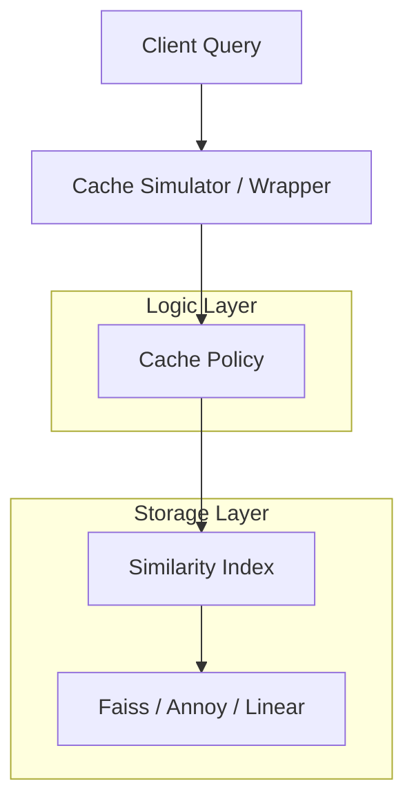

# 🚀 SimCache: Similarity-Based Caching

SimCache è un framework Python professionale per l'implementazione e la valutazione di **cache basate sulla similarità vettoriale**. A differenza delle cache tradizionali (LRU, FIFO) che richiedono chiavi esatte, SimCache usa gli *embedding* per servire "near-misses" come hit, ottimizzando drasticamente le performance in workflow di AI e Retrieval.

---

## 🛠️ Come Iniziare

Per eseguire il progetto, usa l'interfaccia unificata `main.py` dalla cartella principale:

```bash
python3 main.py
```
Dal menu potrai scegliere tra:
- **Dashboard**: Visualizzazione interattiva nel browser (Panel/Holoviews).
- **Benchmark**: Test di performance massivi via terminale.

---

## 🏗️ Architettura del Sistema

Il sistema è progettato per essere modulare e scalabile, separando la logica di ricerca vettoriale dalle politiche di gestione della cache.



### Componenti Core
- **`src/simcache/`**: Il "cuore" del progetto (Package Python).
- **Similarity Index (`Backend.py`)**: Gestisce lo storage dei vettori (Faiss, Annoy, ecc.).
- **Cache Policies (`CachePolicy.py`, `CacheAware.py`)**: Definisce come gestire hit, miss ed evacuazioni.
- **Simulator (`BaseCache.py`)**: Strumento per misurare hit-rate e costi di servizio su diverse tracce di query.

---

## 📂 Struttura del Progetto

```text
.
├── main.py                 # Entry point unificato (Interattivo)
├── src/simcache/           # CORE: Motore di Similarity Caching
│   ├── Backend.py          # Implementazioni indici vettoriali
│   ├── BaseCache.py        # Framework di base e Simulatore
│   ├── CacheAware.py       # Politiche λ-aware (Greedy/OSA)
│   ├── CachePolicy.py      # Politiche standard (LRU/LFU/TTL)
│   └── ...
├── notebooks/              # RESEARCH: Evaluation e Ricerca
│   ├── eval/               # Benchmark e analisi risultati
│   └── research/           # Note e test sperimentali
├── scripts/                # TOOLS: Script di utility e plotting
└── data/                   # DATA: Embedding e dataset (es. .parquet)
```

## 📝 Note per lo Sviluppo
Tutti i moduli nella cartella `src/simcache/` sono progettati per essere importabili come pacchetto. Se crei nuovi script nella radice, usa `import simcache`. Se lavori nei notebook, la configurazione del percorso è automatizzata nelle celle iniziali.

---
*Progetto sviluppato per la ricerca avanzata sulla Similarity Caching.*
