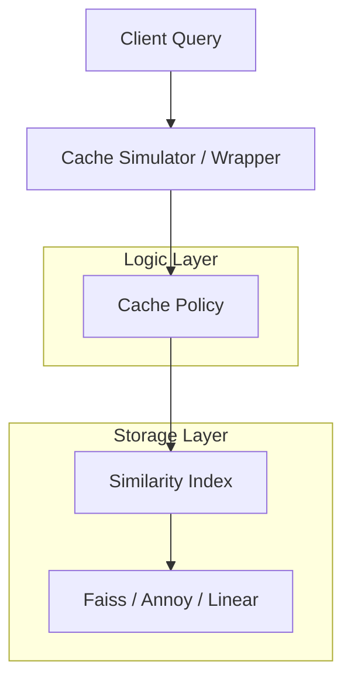

# Architecture Sketch: Similarity Caching System

This project implements a **Similarity-Based Caching Framework**. Unlike traditional caches (LRU, FIFO) that work on exact keys, this system uses vector embeddings to find "similar" items and serve them as hits if they meet a similarity threshold.

## Core Components

### 1. Similarity Index (`Backend.py`)
The `ISimilarityIndex` protocol defines how vectors are stored and queried.
- **Faiss**: High-performance vector search (Flat, IVF, HNSW).
- **Annoy**: Alternative approximate nearest neighbors.
- **Linear**: Simple NumPy-based search (fallback).

### 2. Cache Policies (`BaseCache.py`, `CacheAware.py`, etc.)
Defined by how they handle `hits`, `misses`, and `evictions`:
- **BaseSimilarityCache**: The core logic for `query(key, emb)`.
- **CacheAware**: Strategies that optimize for specific similarity metrics (e.g., θ-threshold).
- **Eviction Polices**: LRU, FIFO, LFU adapted for vector similarity.

### 3. Simulator & Evaluation (`BaseCache.py`, `benchmark_cache_policies.py`)
Allows running traces of queries against different policies to measure:
- **Hit Rate**: % of queries satisfied by the cache.
- **Service Cost**: Penalty for low-similarity hits.
- **Movement Cost**: Cost of updating the cache (evictions/adds).

## Key Workflow

1.  **Query**: Client sends an embedding `v`.
2.  **Search**: `SimilarityIndex` finds the nearest neighbor `v'` with similarity `s`.
3.  **Threshold**: If `s >= θ`, it's a **Hit**.
4.  **Update**: If `s < θ`, it's a **Miss**. The item is added to the cache, potentially triggering an **Eviction** based on the policy.
